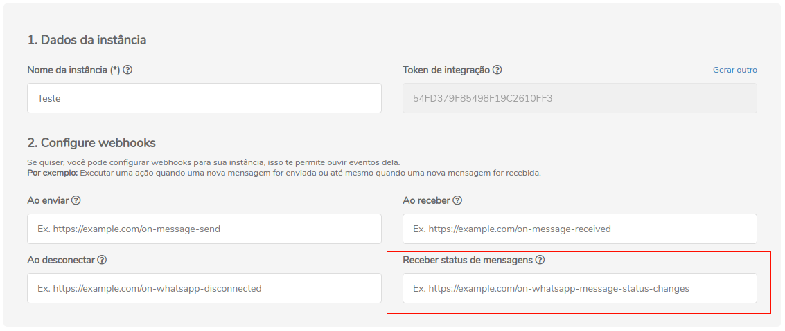

## Conceituação

Esse é o webhook de retorno de conexão do Celular com o PlugZapi

Esse é webhook é disparado quando o PlugZapi se conectada ao Whatsapp, isso pode acontecer quando le o qr-code, quando reiniciar a instancia e etc

:::caution Atenção

O PlugZapi não aceita webhooks que não sejam HTTPS

:::

---

## Atualizando Webhook

Para atualizar a rota do webhook é possível fazer isso pela API ou pelo painel administrativo.

### API

#### /update-webhook-connected

`PUT` <https://api.plugzapi.com.br/instances/SUA_INSTANCIA/token/SEU_TOKEN/update-webhook-connected>

#### Request Body

```json
{
  "value": "https://endereco-do-seu-sistema.com.br/instancia/SUA_INSTANCIA/status"
}
```

---

<!-- ### Painel Administrativo -->

<!--  -->

<!-- --- -->

---

## Retornos dos webhooks

Os possíveis retornos do webhook **on-webhook-connected** estão cadastrado logo abaixo:

## Response

| Atributos | Tipo | Descrição |
| :-- | :-: | :-- |
| connected | boolean | status da instância. |
| phone | string | Número conectado. |
| momment | string | Momento em que a instância foi desconectada do número. |
| type | string | Tipo do evento da instância, nesse caso será "MessageStatusCallback". |

---

### 200

```json
{

  "type": 'ConnectedCallback',
  "connected": true,
  "momment": 26151515154,
  "instanceId": instance.id,
  "phone": "numero",,
  "instanceId": "instance.id"

}
```

### 405

Neste caso certifique que esteja enviando o corretamente a especificação do método, ou seja verifique se você enviou o POST ou GET conforme especificado no inicio deste tópico.

### 415

Caso você receba um erro 415, certifique de adicionar na headers da requisição o "Content-Type" do objeto que você está enviando, em sua grande maioria "application/json"

<!--
## Code

<iframe src="//api.apiembed.com/?source=https://raw.githubusercontent.com/PlugZapi/plugzapi-docs/main/json-examples/on-whatsapp-disconnected.json&targets=all" frameborder="0" scrolling="no" width="100%" height="500px" seamless></iframe> -->
